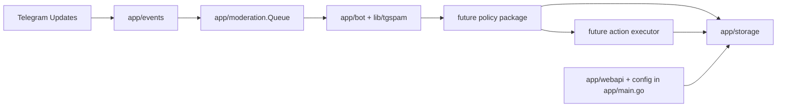

# ADR-0001: Internal moderation pipeline seams

Status: Accepted
Date: 2026-04-13
Supersedes:
Superseded by:

## Implementation plan (step-by-step)

- [x] Analyze the current single-process moderation flow in `app/main.go`, `app/events`, `app/bot`, and `app/storage`
- [x] Define transport-neutral moderation contracts in `app/moderation`
- [x] Add an in-memory `Queue` interface implementation as the first async seam
- [x] Map current packages to roadmap bounded contexts
- [x] Create the initial architecture overview in `docs/Architecture.md`
- [ ] Rewire `app/events/listener.go` to publish `IncomingEvent` instead of invoking the moderation flow directly
- [ ] Add a worker that consumes from the queue and calls detection, policy, action, and audit layers through interfaces
- [ ] Add tracer-bullet smoke coverage for `ingestion -> queue -> worker -> decision -> audit`

## Context

- The current runtime is a single-process Go application with Telegram ingestion in `app/events`, moderation logic behind `app/bot`, and persistence in `app/storage`.
- `docs/ROADMAP.md` and `docs/plans/roadmap/00-foundations-and-internal-pipeline.md` require explicit bounded contexts and an internal asynchronous seam before introducing control-plane, multi-tenant, and slow-path work.
- The existing code already has useful interfaces, but there is no transport-neutral package for moderation contracts and no queue abstraction to separate ingestion from processing.
- Success for the first phase requires small, behavior-preserving increments that keep the modular monolith intact while making future extraction possible.
- This ADR does not introduce RabbitMQ/NATS yet and does not split the runtime into separate OS processes.

## Stakeholders (who needs this to be clear)

| Role | What they need to know | Questions this ADR must answer |
| --- | --- | --- |
| Product / Owner | Why this groundwork matters before new SaaS features | What is delivered now, and what is deferred? |
| Engineering | Package boundaries, contracts, and sequencing | Which packages own ingestion, detection, policy, action, and audit concerns? |
| DevOps / SRE | Runtime shape and rollout risk | Does this change deploy topology now? |
| QA | What must be proven while behavior is preserved | Which seams are new, and what tests cover them? |

## Decision

- Keep the runtime as a modular monolith and introduce an internal moderation seam through a transport-neutral `app/moderation` package plus an in-memory queue abstraction.

Key points:

- Map the current repository to five roadmap bounded contexts without splitting deployables yet: `controlplane`, `gateway`, `detection`, `policy`, and `audit`.
- Treat `app/events` as the current `gateway` boundary responsible for Telegram-specific ingestion and adaptation.
- Treat `app/bot` and `lib/tgspam` as the current `detection` boundary.
- Introduce policy and action contracts explicitly so later steps can move moderation decisions out of `app/events`.
- Start with an in-memory queue so the async seam exists before infrastructure dependencies are introduced.

## Diagram

## Alternatives considered

### Option A: Keep the current direct-call flow until RabbitMQ/NATS is introduced

- Pros:
  - No new package or interface now.
- Cons:
  - Keeps the roadmap blocked on coupled Telegram-specific flow.
  - Makes later extraction riskier because contracts stay implicit.
- Rejected because:
  - The phase-0 roadmap explicitly calls for an internal seam before external queue infrastructure.

### Option B: Split gateway and worker into separate binaries immediately

- Pros:
  - Gets closer to the eventual SaaS target earlier.
- Cons:
  - Requires infra, deploy, and operational work before the contracts are stable.
  - Raises regression risk for the current product.
- Rejected because:
  - The roadmap prefers a modular monolith until operational pain justifies service extraction.

## Consequences

### Positive

- Future work can depend on explicit moderation contracts instead of Telegram structs.
- Queue-backed processing can be introduced incrementally with lower regression risk.
- Architecture docs now reflect the intended target boundaries.

### Negative / risks

- There is temporary duplication while old direct-call flow and new contracts coexist.
- The first queue is in-memory only and does not provide durability.
- Mitigation:
  - Keep the queue API intentionally small and use it first for tracer-bullet wiring, not for full infrastructure promises.

## Impact

### Code

- Affected modules / services:
  - `app/moderation`
  - `app/events`
  - `app/bot`
  - `app/storage`
  - docs under `docs/`
- New boundaries / responsibilities:
  - `app/moderation` owns cross-stage moderation contracts and queue seam
  - `app/events` remains Telegram-specific ingestion until the next slice
- Feature flags / toggles:
  - None in this slice

### Data / configuration

- Data model / schema changes:
  - None in this slice
- Config changes:
  - None in this slice
- Backwards compatibility strategy:
  - Behavior-preserving; current runtime flow remains intact until later slices adopt the queue

### Documentation

- Feature docs to update:
  - None
- Testing docs to update:
  - None
- Architecture docs to update:
  - Create `docs/Architecture.md`
- `docs/Architecture.md` updates:
  - Add module map, contract map, and code-path index
- Notes for `AGENTS.md`:
  - None

## Verification

### Objectives

- Prove the new queue seam can publish, consume, and fail safely on close or canceled context.
- Prove the new slice does not regress the existing listener tracer-bullet baseline.
- Keep architecture docs and ADR links aligned with real repo paths.

### Test environment

- Environment:
  - Local repository workspace with isolated Go 1.25.3 toolchain at `/tmp/go1.25.3/go`
- Data and reset strategy:
  - No schema changes; unit tests only
- External dependencies:
  - None

### Testing methodology

- Core flows and invariants that MUST be proven:
  - `InMemoryQueue.Publish` delivers to `Consume`
  - publish on closed queue fails with `ErrQueueClosed`
  - canceled context aborts publish
  - existing listener baseline test still passes
- Positive flows that MUST pass:
  - queue publish/consume
- Negative / forbidden flows that MUST be rejected or fail safely:
  - publish after close
- Edge / boundary / unexpected flows that MUST be covered:
  - zero-buffer queue with canceled context
  - closed consumer channel
- Required realism level:
  - Unit-level for this slice
- Coverage baseline requirement:
  - No reduction for touched packages
- Pass criteria:
  - New queue tests pass, existing focused listener baseline passes, docs are internally consistent

### Test commands

- build: `make build`
- test: `make test`
- format: `gofmt -w $(rg -l --glob '*.go' -g '!vendor/**' .)`

### New or changed tests

| ID | Scenario | Level (Unit / Int / API / UI) | Expected result | Notes / Data |
| --- | --- | --- | --- | --- |
| TST-001 | Publish and consume one moderation event | Unit | Consumer receives the same event | `app/moderation/queue_test.go` |
| TST-002 | Publish with canceled context | Unit | `context.Canceled` returned | `app/moderation/queue_test.go` |
| TST-003 | Publish after queue close | Unit | `ErrQueueClosed` returned | `app/moderation/queue_test.go` |
| TST-004 | Existing listener baseline | Unit | `TestTelegramListener_Do` stays green | `app/events/listener_test.go` |

### Regression and analysis

- Regression suites to run:
  - `go test ./app/moderation ./app/events -run 'TestInMemoryQueue|TestTelegramListener_Do' -count=1`
- Static analysis:
  - `git diff --check`
- Monitoring during rollout:
  - Not applicable in this slice
- Coverage comparison against baseline:
  - Focused package-level check only

## Rollout and migration

- Migration steps:
  - Land contracts and queue seam first
  - Rewire ingestion in a follow-up change
- Backwards compatibility:
  - No runtime behavior change in this slice
- Rollback:
  - Revert the new package and docs if the seam design proves unsuitable

## References

- Issues / tickets:
  - `docs/ROADMAP.md`
  - `docs/plans/roadmap/00-foundations-and-internal-pipeline.md`
- External docs / specs:
  - None
- Related ADRs:
  - None

## Filing checklist

- [x] File saved under `docs/ADR/ADR-0001-internal-moderation-pipeline-seams.md`
- [x] Status reflects real state
- [x] Links to related docs are filled in
- [x] Diagram section contains a Mermaid diagram
- [x] Testing methodology is filled in
- [x] New automated tests exist for the new queue behavior
- [ ] All relevant tests are green and coverage did not fall below baseline
- [x] `docs/Architecture.md` updated for the new module map
