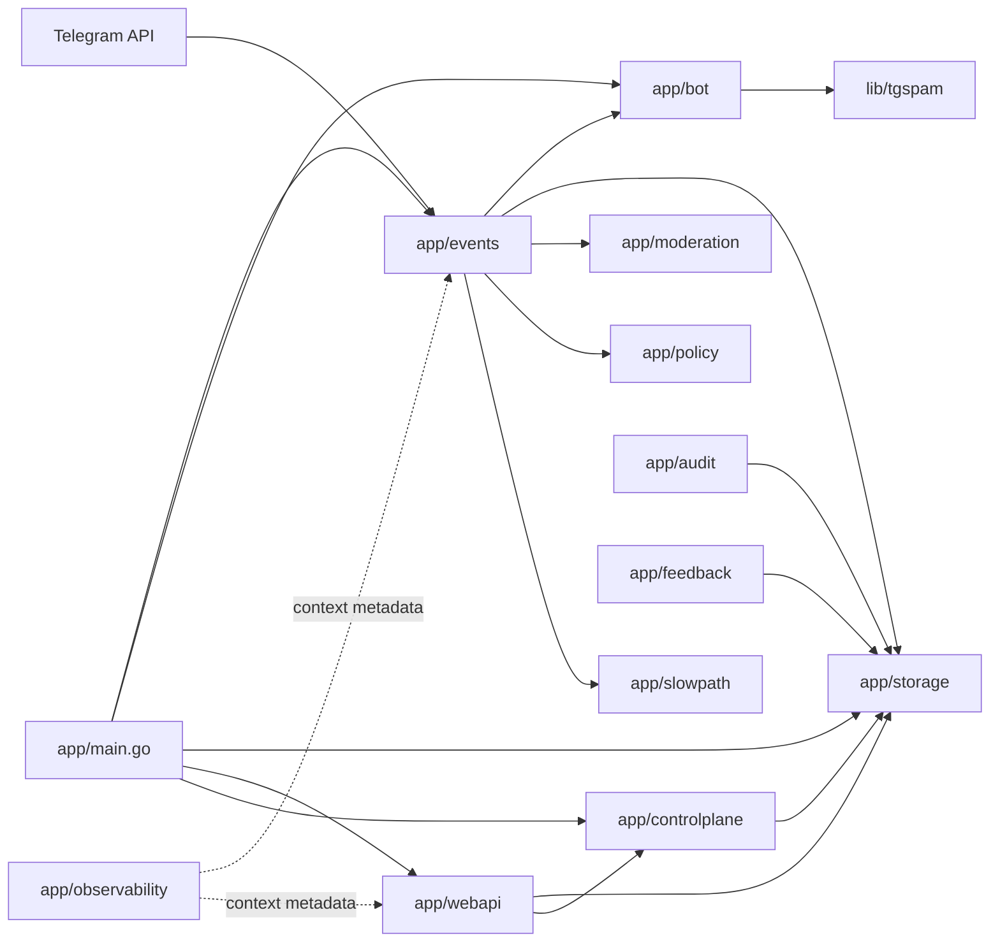
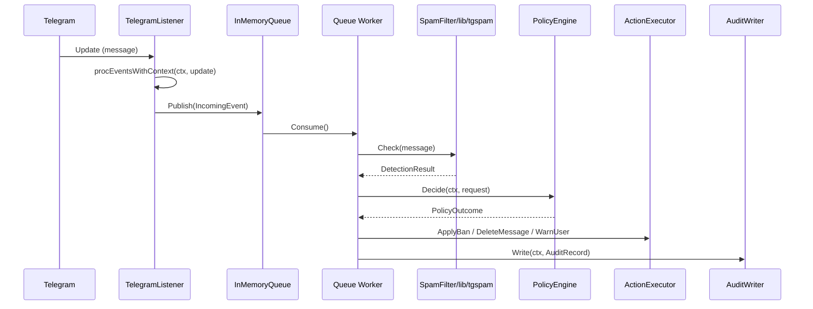
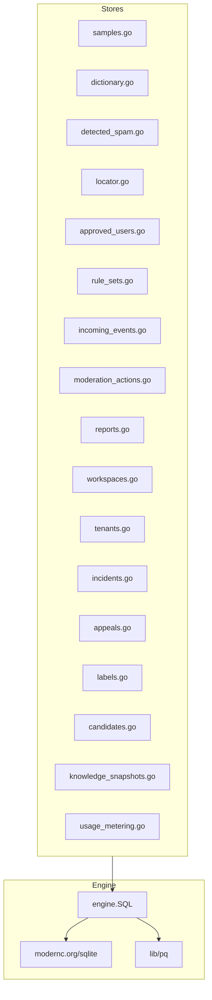
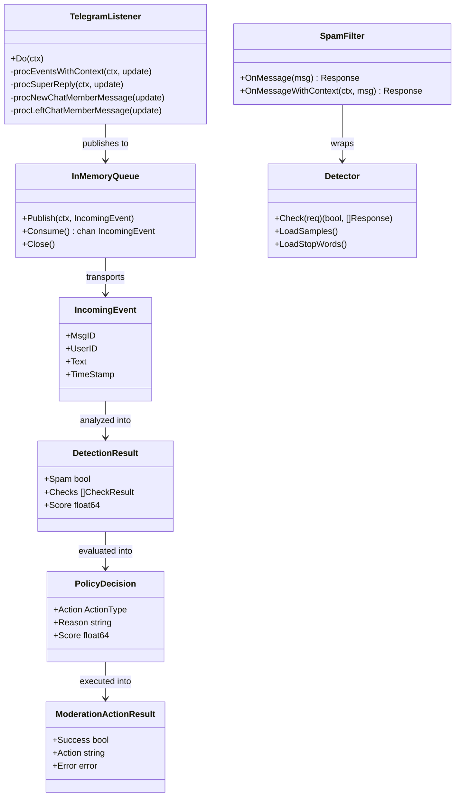

# Architecture Overview

Goal: in ~5 minutes, understand the tg-spam runtime, all module boundaries, and where to start for any task.

This file is the primary start-here card for humans and AI agents. Detailed decisions belong in `docs/ADR/`; detailed roadmap execution lives in `docs/plans/`.

## Summary

- **System:** self-hosted Telegram anti-spam bot with optional web UI and HTTP server
- **Where is the code:** `app/` for runtime and adapters, `lib/` for reusable detection logic, `site/` for documentation site assets, `e2e-ui/` for Playwright tests
- **Entry points:** [`app/main.go`](../app/main.go), [`app/events/listener.go`](../app/events/listener.go), [`app/webapi/webapi.go`](../app/webapi/webapi.go), [`app/runtime_assembly.go`](../app/runtime_assembly.go)
- **Dependencies:** Telegram Bot API, SQLite/Postgres storage, optional OpenAI/Gemini integrations, Docker-based local/runtime packaging
- **Config:** CLI flags + env vars via `go-flags`, ~100 parameters in [`app/main.go`](../app/main.go); explicit CLI/env values override database rule sets

## Scoping

- **In scope:** runtime boundaries, moderation flow, storage layer, web UI, control plane, detection pipeline
- **Out of scope:** vendored code, `_examples/`, `site/` (static docs only)
- Pick impacted modules from the diagrams below, then read the linked code.
- If the work changes boundaries or execution order materially, update this file together with the ADR.

## Diagrams

### System / module map



### Moderation pipeline flow



### Storage layer



### Web API route groups

```mermaid
flowchart LR
  subgraph Middleware
    Recover[Recoverer]
    Sec[SecurityHeaders]
    AuditLog[AdminAuditLogger]
    Sanitize[SanitizeInput]
    Meta[RequestMetadata]
    Logger[Logger]
    Throttle[Throttle 1000]
    Auth[BasicAuth]
    RateLimit[TenantRateLimit]
    Authz[TenantAuthz]
  end

  subgraph API
    Check[/check]
    Samples[/samples /update/spam /update/ham]
    Users[/users/]
    Dict[/dictionary/]
    Rules[/rules/]
    Incidents[/api/incidents/]
    Appeals[/api/appeals/]
    FeedbackAPI[/api/feedback/]
    Metrics[/api/metrics]
    Tenants[/api/tenants/]
  end

  subgraph UI
    Home[/]
    ManageSamples[/manage_samples]
    ManageUsers[/manage_users]
    ManageDict[/manage_dictionary]
    DetectedSpam[/detected_spam]
    Settings[/list_settings]
    IncidentsUI[/incidents]
    AppealsUI[/appeals]
    FeedbackUI[/feedback]
  end

  Middleware --> API
  Middleware --> UI
```

### Key types class diagram



## Navigation index

### Entry points

| File | Purpose |
|------|---------|
| `app/main.go:216` | Primary `func main()`. Parses CLI flags/env, creates DB, assembles runtime, starts Telegram listener and/or web server. |
| `app/events/listener.go:139` | `TelegramListener.Do(ctx)`. Main event loop, dispatches updates to admin, reports, and moderation pipeline. |
| `app/webapi/webapi.go` | HTTP server for server-rendered admin UI and JSON API. |
| `app/runtime_assembly.go:25` | `runtimeAssembly` / `webRuntimeAssembly`. Wires storage, services, listeners together. |

### Module responsibilities

| Package | Responsibility |
|---------|---------------|
| `app/events` | Telegram ingestion, admin handlers, user reports, moderation pipeline (queue, worker), policy engine, action executor, audit writer |
| `app/bot` | Spam filter bridge: wraps `lib/tgspam.Detector` behind interfaces consumed by the event layer |
| `app/moderation` | Transport-neutral contracts (`IncomingEvent`, `DetectionResult`, `PolicyDecision`) and in-memory queue |
| `app/policy` | Policy decision engine with profiles (balanced, strict, permissive) and escalation logic |
| `app/rules` | `RuleSet` domain type — single-tenant moderation configuration snapshot |
| `app/storage` | Persistence: SQLite/Postgres via `engine.SQL` wrapper. 20+ store types |
| `app/storage/engine` | Database engine abstraction: `SQL` type, backup, SQLite-to-Postgres converter, query placeholder adapter |
| `app/webapi` | Server-rendered web UI (HTMX) + JSON API. 50+ routes for spam checking, sample management, incidents, appeals, feedback, metrics, onboarding |
| `app/controlplane` | Service layer: workspace, tenant, rule set (with caching), dictionary, detected spam, onboarding, role authorization, quota/plan, federation |
| `app/audit` | Incident management and appeal resolution |
| `app/feedback` | Feedback labeling, review candidates, knowledge snapshots |
| `app/observability` | Context metadata (`event_id`, `correlation_id`, `idempotency_key`), `Metrics` type (sync/atomic counters and histograms) |
| `app/slowpath` | Slow-path LLM analysis: budget, circuit breaker, OpenAI/Gemini adapters, prompt registry, merge logic |
| `lib/tgspam` | Core spam `Detector`: sequential checks (duplicates, stop words, emoji, meta, CAS, multi-lang, spacing, similarity/Naive Bayes, LLM, Lua plugins, scoring) |
| `lib/tgspam/plugin` | Lua plugin system: script loading, dynamic file reload via fsnotify, Arabic script detector |
| `lib/spamcheck` | Shared request/response types for spam checks, scoring |
| `lib/textnorm` | Text normalization pipeline: lowercase, trim, invisible chars, NFKC, confusables, script folding |
| `lib/approved` | `UserInfo` type for approved users |

### Key interfaces

| Interface | Location | Used by |
|-----------|----------|---------|
| `TbAPI` | `app/events/events.go:26` | Telegram Bot API wrapper |
| `Bot` | `app/events/events.go:96` | Event layer -> spam detection bridge |
| `SpamLogger` | `app/events/events.go:35` | Spam result persistence |
| `Locator` | `app/events/events.go:48` | Message location tracking |
| `ActionExecutor` | `app/events/action_executor.go:15` | Ban/delete/warn execution |
| `PolicyEngine` | `app/events/policy.go:15` | Moderation policy decisions |
| `AuditWriter` | `app/events/audit_writer.go:15` | Audit record persistence |
| `Queue` | `app/moderation/queue.go:10` | In-process moderation queue |
| `Detector` | `app/bot/spam.go:50` | Full spam detection surface |
| `engine.SQL` | `app/storage/engine/engine.go:32` | Database engine abstraction |

### Key types

| Type | Location | Purpose |
|------|----------|---------|
| `TelegramListener` | `app/events/listener.go:36` | Main Telegram event loop |
| `IncomingEvent` | `app/moderation/contracts.go:31` | Transport-neutral moderation input |
| `DetectionResult` | `app/moderation/contracts.go:55` | Detection stage output |
| `PolicyDecision` | `app/moderation/contracts.go:65` | Policy layer outcome |
| `SpamFilter` | `app/bot/spam.go:30` | Wraps `Detector`, bridges event layer |
| `Detector` | `lib/tgspam/detector.go:23` | Core spam detector with sequential checks |
| `RuleSet` | `app/rules/ruleset.go:6` | Single-tenant moderation config snapshot |
| `runtimeAssembly` | `app/runtime_assembly.go:25` | Assembled runtime with all stores, services, listeners |
| `Metrics` | `app/observability/metrics.go` | sync/atomic counters and histograms |
| `Server` | `app/webapi/webapi.go:55` | HTTP server for web UI and JSON API |
| `Engine` | `app/policy/engine.go:42` | Policy engine with profiles and escalation |
| `Normalizer` | `lib/textnorm/normalizer.go:22` | Configurable text normalization pipeline |

## Dependency rules

- `app/events` may depend on `app/bot`, `app/storage`, `app/moderation`, `app/policy`, `app/slowpath`
- `app/bot` may depend on `lib/tgspam` and storage-facing interfaces
- `app/webapi` may depend on storage-facing interfaces, control plane services, and runtime configuration
- `lib/` packages MUST NOT depend on `app/`
- Policy and audit seams MUST NOT depend on Telegram-specific types
- Cross-boundary contracts live in `app/moderation`

## Verification status

| Area | Test files | Coverage focus |
|------|-----------|----------------|
| Event pipeline | `app/events/*_test.go` (30+ files) | Listener, admin, reports, pipeline, policy, audit writer, action executor |
| Web API | `app/webapi/*_test.go` (10+ files) | All handler groups, middleware, rate limiting, rules |
| Storage | `app/storage/*_test.go` (20+ files) | Every store type, engine, backup, conversion |
| Control plane | `app/controlplane/*_test.go` | All service-level tests |
| Audit/feedback | `app/audit/*_test.go`, `app/feedback/*_test.go` | Incident, appeal, feedback, review services |
| Detection | `lib/tgspam/*_test.go` | Detector, classifier, LLM, plugins, scoring, benchmarks |
| Text processing | `lib/textnorm/*_test.go`, `lib/spamcheck/*_test.go` | Normalizer, confusables, scoring |
| Runtime assembly | `app/main_part*_test.go` | Integration tests for runtime assembly |
| E2E UI | `e2e-ui/e2e_test.go` | Playwright end-to-end UI tests |
| Load/stress | Various `*_load_test.go`, `*_stress_test.go`, `*_benchmark_test.go` | Pipeline, storage engine, observability, detection |

## Key decisions (ADRs)

- [ADR-0001 internal moderation pipeline seams](./ADR/ADR-0001-internal-moderation-pipeline-seams.md) — maps current packages to roadmap bounded contexts and defines the initial queue seam

## Where to go next

- Roadmap: [docs/ROADMAP.md](./ROADMAP.md)
- Current phase plan: [docs/plans/roadmap/01-single-tenant-rules-and-idempotency.md](./plans/roadmap/01-single-tenant-rules-and-idempotency.md)
- Decisions: [docs/ADR/](./ADR/)
- Runtime entry point: [app/main.go](../app/main.go)
- Completed plans: [docs/plans/completed/](./plans/completed/)
