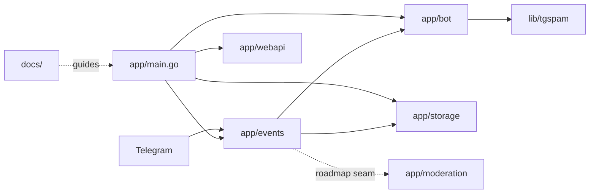
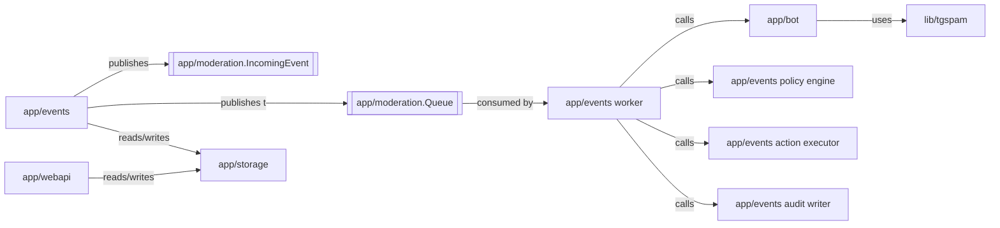
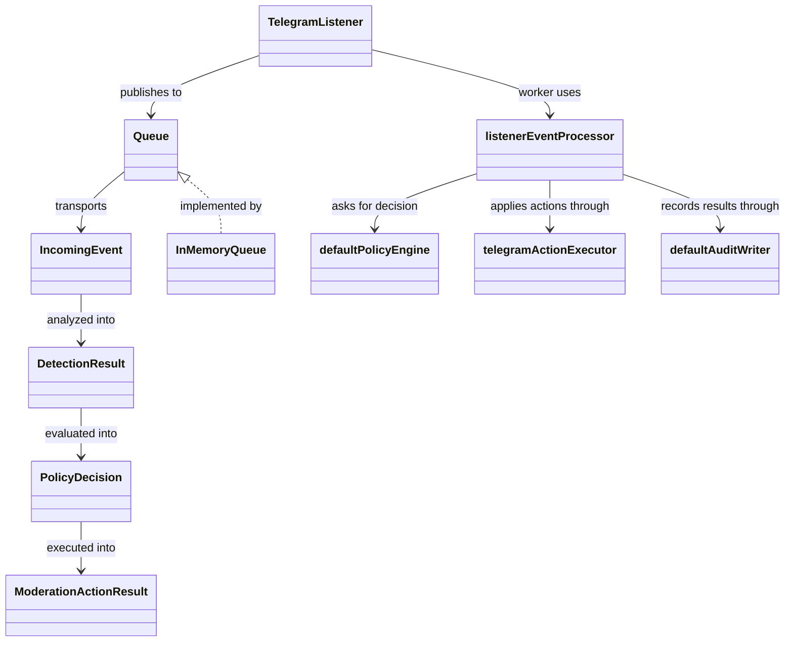

# Architecture Overview

Goal: in ~5 minutes, understand the current tg-spam runtime, the roadmap target boundaries, and where to start for phase-0 moderation pipeline work.

This file is the primary start-here card for humans and AI agents. Detailed decisions belong in `docs/ADR/`; detailed roadmap execution lives in `docs/plans/`.

## Summary

- **System:** self-hosted Telegram anti-spam bot with optional web UI and HTTP server
- **Where is the code:** `app/` for runtime and adapters, `lib/` for reusable detection logic, `site/` for documentation site assets
- **Entry points:** [`app/main.go`](../app/main.go), [`app/events/listener.go`](../app/events/listener.go), [`app/webapi/webapi.go`](../app/webapi/webapi.go)
- **Dependencies:** Telegram Bot API, SQLite/Postgres storage, optional OpenAI/Gemini integrations, Docker-based local/runtime packaging

## Scoping

- **In scope:** runtime boundaries, moderation flow, roadmap phase-0 seam work, current storage and web UI integration points
- **Out of scope:** vendored code, `_examples/`, and future SaaS infrastructure not yet implemented
- Pick impacted modules from the diagrams below, then read the linked ADR and the smallest matching code path.
- If the work changes boundaries or execution order materially, update this file together with the ADR.

## 2) Diagrams

### 2.1 System / module map

### 2.2 Interfaces / contracts map

### 2.3 Key types map

## 3) Navigation index

### 3.1 Modules

- `app/events` — Telegram ingestion, queue publication, in-process worker, policy evaluation, action execution, audit writing, and high-level event orchestration; code: [app/events/](../app/events/); entry points: [listener.go](../app/events/listener.go), [pipeline.go](../app/events/pipeline.go), [policy.go](../app/events/policy.go), [action_executor.go](../app/events/action_executor.go), [audit_writer.go](../app/events/audit_writer.go), [events.go](../app/events/events.go); docs: [ADR-0001](./ADR/ADR-0001-internal-moderation-pipeline-seams.md)
- `app/bot` — moderation-facing bot interface and current detection orchestration; code: [app/bot/](../app/bot/); entry point: [spam.go](../app/bot/spam.go)
- `lib/tgspam` — reusable spam detection heuristics and optional LLM integrations; code: [lib/tgspam/](../lib/tgspam/)
- `lib/textnorm` — shared text normalization stages for detector-facing cleanup and future script folding; code: [lib/textnorm/](../lib/textnorm/)
- `app/storage` — persistence for samples, reports, detected spam, locators, bootstrap rule sets, ingress `incoming_events`, and executor `moderation_actions` with retry/replay lookup by command target; code: [app/storage/](../app/storage/)
- `app/webapi` — server-rendered admin UI and HTTP endpoints; code: [app/webapi/](../app/webapi/)
- `app/moderation` — transport-neutral moderation contracts and internal queue seam for roadmap phase 0; code: [app/moderation/](../app/moderation/); docs: [ADR-0001](./ADR/ADR-0001-internal-moderation-pipeline-seams.md)
- `app/rules` — single-tenant moderation rule domain snapshots introduced for phase 1 bootstrap persistence; code: [app/rules/](../app/rules/)

### 3.2 Interfaces / contracts

- `IncomingEvent` — source of truth: [app/moderation/contracts.go](../app/moderation/contracts.go); producer: `app/events`; future consumer: phase-0 worker
- `DetectionResult` — source of truth: [app/moderation/contracts.go](../app/moderation/contracts.go); producer: detection layer; consumer: policy layer
- `PolicyDecision` — source of truth: [app/moderation/contracts.go](../app/moderation/contracts.go); producer: future policy package; consumer: action executor and audit writer
- `Queue` — source of truth: [app/moderation/queue.go](../app/moderation/queue.go); producer: ingestion; consumer: [app/events/pipeline.go](../app/events/pipeline.go); docs: [ADR-0001](./ADR/ADR-0001-internal-moderation-pipeline-seams.md)

### 3.3 Key types

- `TelegramListener` — defined in [app/events/listener.go](../app/events/listener.go); used by `app/main.go`
- `IncomingEvent` — defined in [app/moderation/contracts.go](../app/moderation/contracts.go); used by future gateway/worker seam
- `InMemoryQueue` — defined in [app/moderation/queue.go](../app/moderation/queue.go); used by phase-0 tracer-bullet wiring
- `listenerEventProcessor` — defined in [app/events/pipeline.go](../app/events/pipeline.go); adapts queued moderation events back into the current runtime flow
- `defaultPolicyEngine` — defined in [app/events/policy.go](../app/events/policy.go); converts detection results into explicit moderation decisions
- `telegramActionExecutor` — defined in [app/events/action_executor.go](../app/events/action_executor.go); applies bans/restrictions, message deletions, and warning messages through the shared executor surface
- `defaultAuditWriter` — defined in [app/events/audit_writer.go](../app/events/audit_writer.go); records moderation results through current logging and locator sinks
- `app/observability` metadata helper — defined in [app/observability/context.go](../app/observability/context.go); carries `event_id` and `correlation_id` through the moderation tracer-bullet path
- `app/webapi` request metadata middleware — defined in [app/webapi/webapi.go](../app/webapi/webapi.go); attaches `event_id` and `correlation_id` to request context and response headers
- `runtimeProbe` — defined in [app/runtime_probe.go](../app/runtime_probe.go); exposes `/healthz` and `/readyz` for the main process independently of `app/webapi`
- `runtimeAssembly` — defined in [app/runtime_assembly.go](../app/runtime_assembly.go); assembles storage, gateway, and web runtime seams before `execute` orchestrates startup
- `RuleSet` — defined in [app/rules/ruleset.go](../app/rules/ruleset.go); persisted bootstrap moderation configuration for one workspace
- `IncomingEvents` — defined in [app/storage/incoming_events.go](../app/storage/incoming_events.go); durable ingress ledger keyed by Telegram idempotency key before queue publication
- `IncomingEvents` replay snapshot — stored in [app/storage/incoming_events.go](../app/storage/incoming_events.go); captures completed decision/action state so duplicate Telegram retries can short-circuit before worker execution
- Active runtime `RuleSet` — loaded in [app/runtime_assembly.go](../app/runtime_assembly.go); now drives detector flags plus listener moderation/report configuration
- `textnorm.Normalizer` — defined in [lib/textnorm/normalizer.go](../lib/textnorm/normalizer.go); centralizes lower-case, trim, invisible-character cleanup, canonical whitespace, and script-fold hooks
- `ModerationActions` — defined in [app/storage/moderation_actions.go](../app/storage/moderation_actions.go); durable executor command journal for bans, restrictions, and deletes, including latest-attempt replay lookup for idempotent command execution
- Report-driven sanctions in [app/events/reports.go](../app/events/reports.go) now flow through the shared `ActionExecutor`, so manual report approval and auto-ban thresholds reuse the same command journal and replay boundary as the queue worker
- Reporter-ban callbacks in [app/events/reports.go](../app/events/reports.go) also reuse the shared `ActionExecutor`, closing the remaining direct report-side ban path
- Admin `/warn` handling in [app/events/admin.go](../app/events/admin.go) now also reuses the shared `ActionExecutor`, so delete-plus-warn flows carry idempotency metadata and enter the same journal boundary as the rest of moderation actions
- Enriched moderation audit now persists into [app/storage/detected_spam.go](../app/storage/detected_spam.go) with `signal_source`, `score`, `matched_rules`, `rule_set_version`, and `idempotency_key`, fed by [app/events/audit_writer.go](../app/events/audit_writer.go) and the runtime spam logger
- Failed Telegram action attempts remain retryable in [app/storage/incoming_events.go](../app/storage/incoming_events.go): failure snapshots keep decision/error state without setting `processed_at`, so a later duplicate delivery can re-enter the pipeline without duplicating successful audit writes

## 7) Verification status

- Phase-0 tracer bullet is covered by [TestTelegramListener_TracerBulletSmoke](../app/events/listener_test.go), which proves:
  - queue publication from the listener
  - worker execution
  - detection
  - policy decision
  - action execution
  - audit recording
- Baseline listener behavior is still covered by [TestTelegramListener_Do](../app/events/listener_test.go) and [TestTelegramListener_DoWithBotBan](../app/events/listener_test.go), which stay green through the queue-backed path.
- Correlation metadata is covered by the moderation-path tests in [app/events/listener_test.go](../app/events/listener_test.go), which prove the same `event_id` and `correlation_id` reach detection, action, audit, and locator calls.
- Correlation metadata is also covered for `app/webapi` requests in [app/webapi/webapi_test.go](../app/webapi/webapi_test.go), which prove request metadata reaches downstream storage calls and request-scoped logs.
- Main-runtime probe coverage is in [app/runtime_probe_test.go](../app/runtime_probe_test.go) and [app/main_test.go](../app/main_test.go), which prove the core process exposes `/healthz` and `/readyz` when configured.
- Runtime assembly coverage remains in [app/main_test.go](../app/main_test.go), with startup behavior preserved while `execute` now orchestrates higher-level assemblies instead of wiring the full concrete chain inline.
- Incoming-event ingress coverage is in [app/storage/incoming_events_test.go](../app/storage/incoming_events_test.go) and [app/events/listener_test.go](../app/events/listener_test.go), which prove deterministic Telegram idempotency keys and idempotent persistence before queue publication.
- Replay coverage is in [app/storage/incoming_events_test.go](../app/storage/incoming_events_test.go) and [app/events/listener_test.go](../app/events/listener_test.go), which prove completed moderation snapshots are persisted and duplicate retries do not re-enter the worker.
- Active-rule-set runtime coverage is in [app/main_test.go](../app/main_test.go), which proves a persisted active `RuleSet` overrides bootstrap defaults for detector behavior and listener moderation/report settings.
- Text-normalization seam coverage is in [lib/textnorm/normalizer_test.go](../lib/textnorm/normalizer_test.go) plus the existing detector cleanup tests in [lib/tgspam/detector_test.go](../lib/tgspam/detector_test.go).
- Action-journal and replay coverage is in [app/storage/moderation_actions_test.go](../app/storage/moderation_actions_test.go), [app/events/action_executor_test.go](../app/events/action_executor_test.go), and [app/main_test.go](../app/main_test.go).
- Report-executor coverage is in [app/events/reports_test.go](../app/events/reports_test.go), which proves report approval and report auto-ban reuse the shared action executor.
- Reporter-ban callback coverage is in [app/events/reports_test.go](../app/events/reports_test.go), which proves `callbackReportBanReporterConfirm` now uses the shared action executor.
- Audit enrichment coverage is in [app/storage/detected_spam_test.go](../app/storage/detected_spam_test.go), [app/events/audit_writer_test.go](../app/events/audit_writer_test.go), and [app/main_test.go](../app/main_test.go), which prove enriched audit data including `idempotency_key` persists through the runtime spam logger into `detected_spam`.
- Retry-recovery integration coverage is in [app/storage/incoming_events_test.go](../app/storage/incoming_events_test.go) and [app/events/listener_test.go](../app/events/listener_test.go), which prove processed duplicates are suppressed, failed Telegram actions stay retryable, and retries do not create duplicate final audit entries.
- Shared warn-executor coverage is in [app/events/action_executor_test.go](../app/events/action_executor_test.go), [app/events/admin_test.go](../app/events/admin_test.go), and [app/events/listener_test.go](../app/events/listener_test.go), which prove `WarnUser` is journaled and runtime `/warn` flows reuse the shared action executor.

## 4) Dependency rules

- Allowed dependencies:
  - `app/events` may depend on `app/bot`, `app/storage`, and `app/moderation`
  - `app/bot` may depend on `lib/tgspam` and storage-facing interfaces
  - `app/webapi` may depend on storage-facing interfaces and runtime configuration
- Forbidden dependencies:
  - `lib/` packages should not depend on `app/`
  - future `policy` and `audit` seams should not depend on Telegram-specific types
- Integration style:
  - current state: synchronous calls inside one process
  - target phase-0 state: internal queue plus worker inside the same process
- Shared code policy:
  - cross-stage contracts live in `app/moderation` until a stronger shared-domain boundary is needed

## 5) Key decisions (ADRs)

- [ADR-0001 internal moderation pipeline seams](./ADR/ADR-0001-internal-moderation-pipeline-seams.md) — maps current packages to roadmap bounded contexts and defines the initial queue seam

## 6) Where to go next

- Roadmap: [docs/ROADMAP.md](./ROADMAP.md)
- Current phase plan: [docs/plans/roadmap/01-single-tenant-rules-and-idempotency.md](./plans/roadmap/01-single-tenant-rules-and-idempotency.md)
- Decisions: [docs/ADR/](./ADR/)
- Runtime entry point: [app/main.go](../app/main.go)
