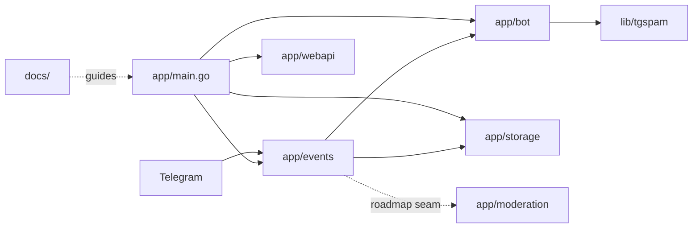
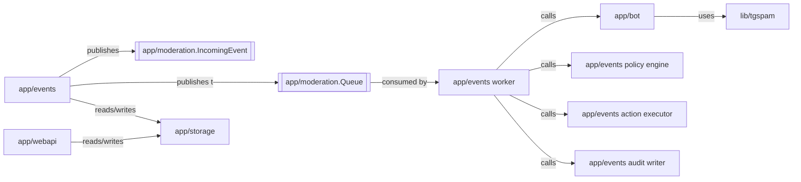
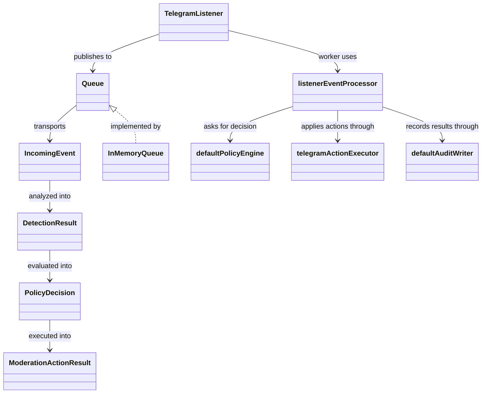

# Architecture Overview

Goal: in ~5 minutes, understand the current tg-spam runtime, the roadmap target boundaries, and where to start for phase-0 moderation pipeline work.

This file is the primary start-here card for humans and AI agents. Detailed decisions belong in `docs/ADR/`; detailed roadmap execution lives in `docs/plans/`.

## Summary

- **System:** self-hosted Telegram anti-spam bot with optional web UI and HTTP server
- **Where is the code:** `app/` for runtime and adapters, `lib/` for reusable detection logic, `site/` for documentation site assets
- **Entry points:** [`app/main.go`](../app/main.go), [`app/events/listener.go`](../app/events/listener.go), [`app/webapi/webapi.go`](../app/webapi/webapi.go)
- **Dependencies:** Telegram Bot API, SQLite/Postgres storage, optional OpenAI/Gemini integrations, Docker-based local/runtime packaging

## Scoping

- **In scope:** runtime boundaries, moderation flow, roadmap phase-0 seam work, current storage and web UI integration points
- **Out of scope:** vendored code, `_examples/`, and future SaaS infrastructure not yet implemented
- Pick impacted modules from the diagrams below, then read the linked ADR and the smallest matching code path.
- If the work changes boundaries or execution order materially, update this file together with the ADR.

## 2) Diagrams

### 2.1 System / module map

### 2.2 Interfaces / contracts map

### 2.3 Key types map

## 3) Navigation index

### 3.1 Modules

- `app/events` — Telegram ingestion, queue publication, in-process worker, policy evaluation, action execution, audit writing, and high-level event orchestration; code: [app/events/](../app/events/); entry points: [listener.go](../app/events/listener.go), [pipeline.go](../app/events/pipeline.go), [policy.go](../app/events/policy.go), [action_executor.go](../app/events/action_executor.go), [audit_writer.go](../app/events/audit_writer.go), [events.go](../app/events/events.go); docs: [ADR-0001](./ADR/ADR-0001-internal-moderation-pipeline-seams.md)
- `app/bot` — moderation-facing bot interface and current detection orchestration; code: [app/bot/](../app/bot/); entry point: [spam.go](../app/bot/spam.go)
- `lib/tgspam` — reusable spam detection heuristics and optional LLM integrations; code: [lib/tgspam/](../lib/tgspam/)
- `app/storage` — persistence for samples, reports, detected spam, and locators; code: [app/storage/](../app/storage/)
- `app/webapi` — server-rendered admin UI and HTTP endpoints; code: [app/webapi/](../app/webapi/)
- `app/moderation` — transport-neutral moderation contracts and internal queue seam for roadmap phase 0; code: [app/moderation/](../app/moderation/); docs: [ADR-0001](./ADR/ADR-0001-internal-moderation-pipeline-seams.md)

### 3.2 Interfaces / contracts

- `IncomingEvent` — source of truth: [app/moderation/contracts.go](../app/moderation/contracts.go); producer: `app/events`; future consumer: phase-0 worker
- `DetectionResult` — source of truth: [app/moderation/contracts.go](../app/moderation/contracts.go); producer: detection layer; consumer: policy layer
- `PolicyDecision` — source of truth: [app/moderation/contracts.go](../app/moderation/contracts.go); producer: future policy package; consumer: action executor and audit writer
- `Queue` — source of truth: [app/moderation/queue.go](../app/moderation/queue.go); producer: ingestion; consumer: [app/events/pipeline.go](../app/events/pipeline.go); docs: [ADR-0001](./ADR/ADR-0001-internal-moderation-pipeline-seams.md)

### 3.3 Key types

- `TelegramListener` — defined in [app/events/listener.go](../app/events/listener.go); used by `app/main.go`
- `IncomingEvent` — defined in [app/moderation/contracts.go](../app/moderation/contracts.go); used by future gateway/worker seam
- `InMemoryQueue` — defined in [app/moderation/queue.go](../app/moderation/queue.go); used by phase-0 tracer-bullet wiring
- `listenerEventProcessor` — defined in [app/events/pipeline.go](../app/events/pipeline.go); adapts queued moderation events back into the current runtime flow
- `defaultPolicyEngine` — defined in [app/events/policy.go](../app/events/policy.go); converts detection results into explicit moderation decisions
- `telegramActionExecutor` — defined in [app/events/action_executor.go](../app/events/action_executor.go); applies bans/restrictions and message deletions
- `defaultAuditWriter` — defined in [app/events/audit_writer.go](../app/events/audit_writer.go); records moderation results through current logging and locator sinks
- `app/observability` metadata helper — defined in [app/observability/context.go](../app/observability/context.go); carries `event_id` and `correlation_id` through the moderation tracer-bullet path

## 7) Verification status

- Phase-0 tracer bullet is covered by [TestTelegramListener_TracerBulletSmoke](../app/events/listener_test.go), which proves:
  - queue publication from the listener
  - worker execution
  - detection
  - policy decision
  - action execution
  - audit recording
- Correlation metadata is covered by the moderation-path tests in [app/events/listener_test.go](../app/events/listener_test.go), which prove the same `event_id` and `correlation_id` reach detection, action, audit, and locator calls.

## 4) Dependency rules

- Allowed dependencies:
  - `app/events` may depend on `app/bot`, `app/storage`, and `app/moderation`
  - `app/bot` may depend on `lib/tgspam` and storage-facing interfaces
  - `app/webapi` may depend on storage-facing interfaces and runtime configuration
- Forbidden dependencies:
  - `lib/` packages should not depend on `app/`
  - future `policy` and `audit` seams should not depend on Telegram-specific types
- Integration style:
  - current state: synchronous calls inside one process
  - target phase-0 state: internal queue plus worker inside the same process
- Shared code policy:
  - cross-stage contracts live in `app/moderation` until a stronger shared-domain boundary is needed

## 5) Key decisions (ADRs)

- [ADR-0001 internal moderation pipeline seams](./ADR/ADR-0001-internal-moderation-pipeline-seams.md) — maps current packages to roadmap bounded contexts and defines the initial queue seam

## 6) Where to go next

- Roadmap: [docs/ROADMAP.md](./ROADMAP.md)
- Current phase plan: [docs/plans/roadmap/00-foundations-and-internal-pipeline.md](./plans/roadmap/00-foundations-and-internal-pipeline.md)
- Decisions: [docs/ADR/](./ADR/)
- Runtime entry point: [app/main.go](../app/main.go)
